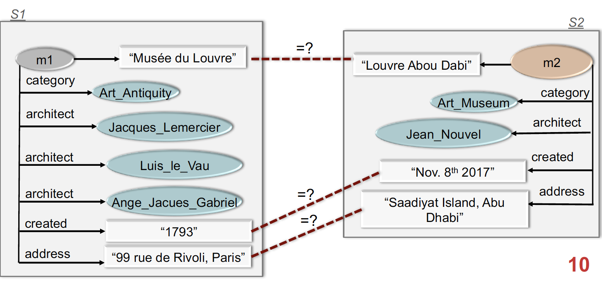
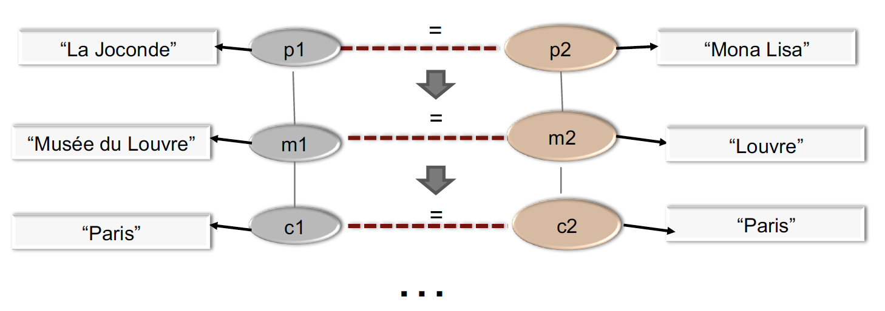
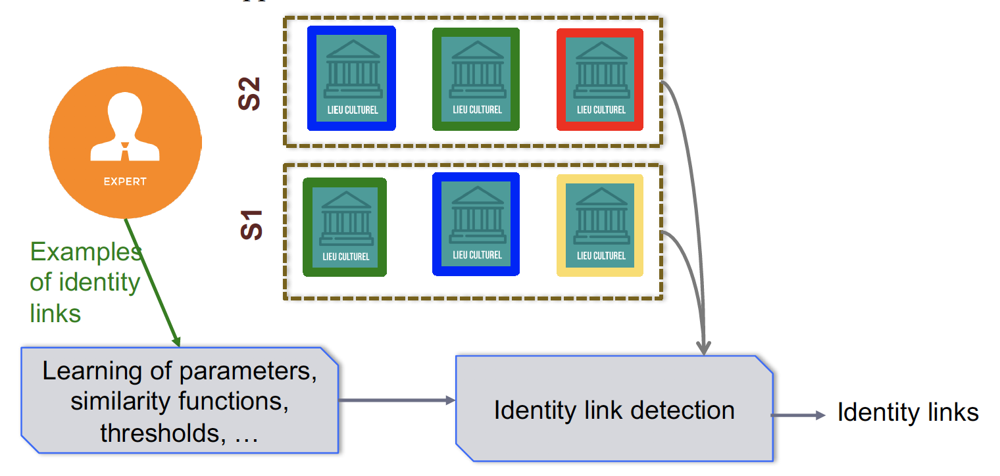
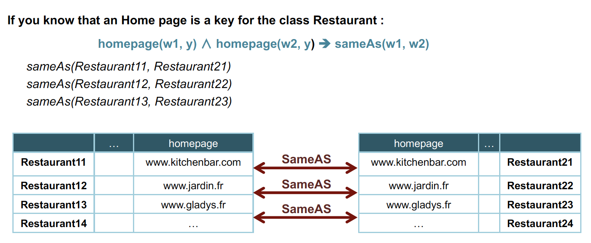

# Knowledge Graph

## Definition

A **Knowledge Graph** is a structured Knowledge Base. **Knowledge Graphs** store facts in the form of *relations* between different *entities*. By extracting facts from a knowledge base and representing these facts in the form *entities* and *relations*, a knowledge graph claims to have an understanding of the information.

More formally, a **Knowledge Graph** is a very large semantic nets that integrate various and heterogeneous information sources to represent knowledge about certain domains of discourse.
* A **graph** is a mathematical structure in which some pairs in a set of objects are somehow related.
* We describe **knowledge** to the actions of an agent.
* An agent would interpret a **knowledge graph** to make rational decisions to take actions to reach its goals.

An **ontology** is an explicit, formal specification of a shared conceptualization.
* conceptualization: abstract model of domain related expressions
* specification: domain related
* explicit: semantics of all expressions is clear
* formal: machine-readable
* shared: concensus

A **knowledge graph** (i) mainly describes real-world entities and their interrelations, organized in a graph, (ii) defines possible classes and relations of entities in a schema, (iii) allows for potentially interrelating arbitrary entities with each other and (iv) covers various topical domains.

In essence, **Resource Description Framework (RDF)** is an Information Model, much like the Relational Database Model. In fact, one could say that RDF is a Relational "Triple" Model, in which a statement of \<subject, predicate, object\> is called a triple.

Here is a simple triple within a knowledge base.

* Subject : Louvre
* Predicate : is located
* Object : Paris

In practice, knowledge bases include millions of such triples, which we also term as **facts**. These facts are grouped under ontologies in knowledge bases. An **ontology** is an identifying category for a particular domain of facts. Hence, an ontology explains what sort of entities exist within that category.

## Expansion & Enrichment & Validation

* Expansion: knowledge graphs are incomplete
  * data linking (entity resolution, reference reconciliation)
  * link prediction: add relations
  * ontology matching: connect graphs
  * missing values prediction / inference
* Enrichment: new knowledge merges from knowledge graphs
  * knowledge discovery: key discovery
  * automatic reasoning and planning
* Validation: knowledge graphs may contain errors
  * link validation
  * dealing with errors and ambiguities

#### Data Linking

**Data linking** or **identity link detection** consist of detecting whether two descriptions of resources refer to the same real-world entity.

Some approaches are available
* *Local approaches*: consider properties to compare pairs of instances independently
  * 
* *Global approaches*: consider data type properties as well as object properties to propagate similarity scores / linking decisions (collective data linking)
  * 
* *Supervised approaches*: need samples of linked data to learn models, or need interactions with expert (interactive approaches)
  * 
* *Informed approaches*: need knowledge to be declared in the ontology or in other format
  * 

**Keys** ```restaurant(r1) $\uparrow$ restaurant(r2) $\uparrow$ address(r1, a) $\uparrow$ address(r2, a)``` -> ```sameAs(r1, r2)```  
**Disjoint classes** ```C1(x) $\uparrow$ C2(y)``` -> ```differentFrom(x, y)```  
**Functional Datatype properties** ```sameAs(r1, r2) $\uparrow$ city(r1, c1) $\uparrow$ city(r2, c2)``` -> ```equivalentString(c1, c2)```  
**Local-UNA** ```authored(p, a1) $\uparrow$ authored(p, a2)``` -> ```differentFrom(a1, a2)```  
**Referring expression** ```name(p1, 'Obama') $\uparrow$ profession(p1, 'president')``` -> ```sameAs(p1, http://...81)```  

## Reference

1. [How to build a Knowledge Graph](tutorials/HowToBuildKnowledgeGraph.pdf)
2. [Kishore @ Medium](https://medium.com/analytics-vidhya/a-knowledge-graph-implementation-tutorial-for-beginners-3c53e8802377)
3. [Knowledge Graph Completion: Introduction](https://www.lri.fr/~sais/KGC/1-Introduction.pdf)
4. [Knowledge Graph Completion: Data Linking](https://www.lri.fr/~sais/KGC/2-DataLinking-final.pdf)
5. [Knowledge Graph Completion: Key Discovery](https://www.lri.fr/~sais/KGC/3-KeyDiscovery_Final.pdf)
6. [Knowledge Graph Completion: Identity Link Validation](https://www.lri.fr/~sais/KGC/4-IdentityProblem.pdf)
7. [Conceptualizing the Knowledge Graph Construction Pipeline](https://towardsdatascience.com/conceptualizing-the-knowledge-graph-construction-pipeline-33edb25ab831)